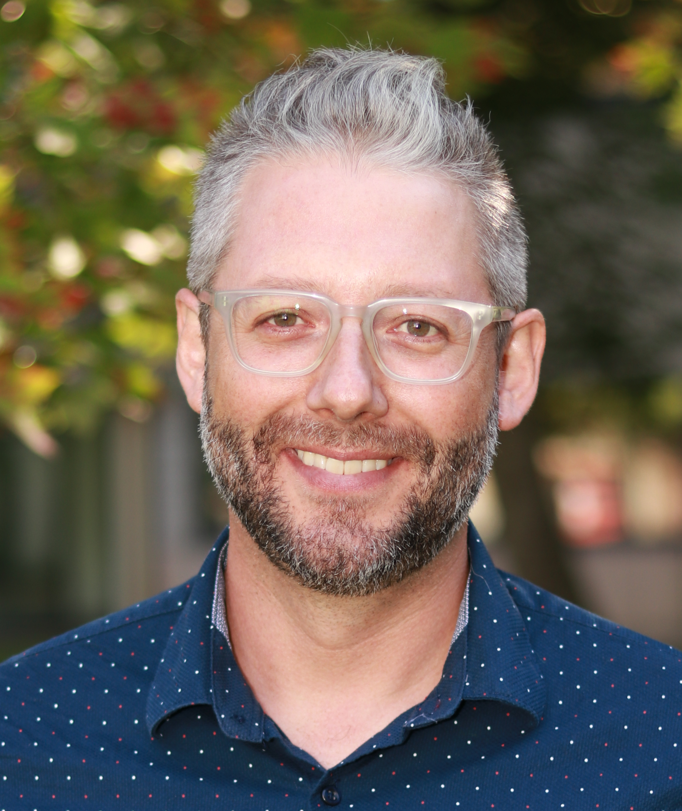

# Dr. Aaron Mauro

## Hi, my name is Aaron!
I'm is Assistant Professor of Digital Media at Brock University in the Centre for Digital Humanities. I teach on topics relating to digital culture, natural language processing, and app development. I've published articles on U.S. literature and culture have appeared in Modern Fiction Studies, Mosaic, and Symploke among others. I have also published on issues relating to digital humanities in both Digital Studies and Digital Humanities Quarterly. My forethcoming book is called _Cybersecurity and the Humanities_ (Emerald Press, 2020). 

 

#### Dr. Aaron Mauro
#### [Centre for Digital Humanities](https://brocku.ca/humanities/digital-humanities/)
#### Brock University
#### 1812 Sir Isaac Brock Way
#### St. Catharines, ON
#### L2S 3A1 Canada

[Twitter](https://www.twitter.com/onthename)
 
[Github](https://www.github.com/aaronmauro)
 
amauro{AT}brocku{DOT}ca
